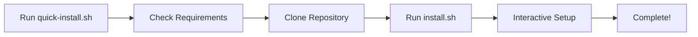

# ⚡ Quick Installation Guide

> **Clone และติดตั้ง TP-Affiliate ในคำสั่งเดียว!**

## 🚀 One-Line Installation

### วิธีที่ 1: ใช้ curl (แนะนำ)

```bash
curl -fsSL https://raw.githubusercontent.com/xjanova/Thaiprompt-Affiliate/claude/Main/quick-install.sh | bash
```

### วิธีที่ 2: ใช้ wget

```bash
wget -qO- https://raw.githubusercontent.com/xjanova/Thaiprompt-Affiliate/claude/Main/quick-install.sh | bash
```

### วิธีที่ 3: Clone แล้วรัน

```bash
git clone -b claude/Main https://github.com/xjanova/Thaiprompt-Affiliate.git
cd Thaiprompt-Affiliate
bash quick-install.sh
```

---

## 📋 สิ่งที่ quick-install.sh ทำให้คุณอัตโนมัติ

1. ✅ **ตรวจสอบ System Requirements**
   - Git, PHP 8.1+, Composer
   - ติดตั้ง Composer อัตโนมัติถ้ายังไม่มี

2. ✅ **Clone Repository**
   - ดึงโค้ดล่าสุดจาก `claude/Main` branch
   - สร้างโฟลเดอร์ `thaiprompt-affiliate`

3. ✅ **รัน install.sh**
   - ตรวจสอบและ restore ไฟล์สำคัญ 35 ไฟล์
   - ติดตั้ง Composer dependencies
   - สร้าง .env file
   - Generate application key
   - รัน migrations & seeders
   - สร้าง Super Admin account
   - Optimize production caches

---

## 🎯 Installation Flow



**ระยะเวลาติดตั้ง:** 5-10 นาที (ขึ้นอยู่กับความเร็ว internet)

---

## 💡 ตัวเลือกการติดตั้ง

### ติดตั้งในโฟลเดอร์ที่กำหนดเอง

```bash
# Clone มาก่อน
git clone -b claude/Main https://github.com/xjanova/Thaiprompt-Affiliate.git my-project
cd my-project

# รัน install.sh โดยตรง
./install.sh
```

### ติดตั้งบน Production Server

```bash
# SSH เข้าเซิร์ฟเวอร์
ssh user@your-server.com

# ไปที่โฟลเดอร์ web root
cd /var/www/html  # หรือ /home/user/public_html

# รัน quick install
curl -fsSL https://raw.githubusercontent.com/xjanova/Thaiprompt-Affiliate/claude/Main/quick-install.sh | bash
```

---

## 🔧 ข้อมูลที่ต้องเตรียมก่อนติดตั้ง

quick-install.sh จะถามข้อมูลเหล่านี้:

### 1. Application Configuration
- **Application Name:** ชื่อแอปพลิเคชัน (default: TP-Affiliate)
- **Application URL:** URL ของเว็บไซต์ (เช่น https://example.com)
- **Environment:** Production หรือ Development

### 2. Database Configuration
- **Database Host:** ที่อยู่ MySQL server (default: 127.0.0.1)
- **Database Port:** พอร์ต MySQL (default: 3306)
- **Database Name:** ชื่อฐานข้อมูล
- **Database Username:** ชื่อผู้ใช้ฐานข้อมูล
- **Database Password:** รหัสผ่านฐานข้อมูล

### 3. Super Admin Account
- **Admin Name:** ชื่อผู้ดูแลระบบ
- **Admin Email:** อีเมลผู้ดูแลระบบ
- **Admin Password:** รหัสผ่าน (ขั้นต่ำ 8 ตัวอักษร)

---

## ✅ หลังติดตั้งเสร็จ

### ทดสอบด้วย Built-in Server

```bash
cd thaiprompt-affiliate
php artisan serve
```

จากนั้นเปิดเบราว์เซอร์: http://localhost:8000

### ตั้งค่า Web Server (Production)

#### Nginx Configuration

```nginx
server {
    listen 80;
    server_name example.com;
    root /path/to/thaiprompt-affiliate/public;

    add_header X-Frame-Options "SAMEORIGIN";
    add_header X-Content-Type-Options "nosniff";

    index index.php;

    charset utf-8;

    location / {
        try_files $uri $uri/ /index.php?$query_string;
    }

    location = /favicon.ico { access_log off; log_not_found off; }
    location = /robots.txt  { access_log off; log_not_found off; }

    error_page 404 /index.php;

    location ~ \.php$ {
        fastcgi_pass unix:/var/run/php/php8.1-fpm.sock;
        fastcgi_param SCRIPT_FILENAME $realpath_root$fastcgi_script_name;
        include fastcgi_params;
    }

    location ~ /\.(?!well-known).* {
        deny all;
    }
}
```

#### Apache Configuration (.htaccess)

```apache
<IfModule mod_rewrite.c>
    <IfModule mod_negotiation.c>
        Options -MultiViews -Indexes
    </IfModule>

    RewriteEngine On

    # Handle Authorization Header
    RewriteCond %{HTTP:Authorization} .
    RewriteRule .* - [E=HTTP_AUTHORIZATION:%{HTTP:Authorization}]

    # Redirect Trailing Slashes If Not A Folder...
    RewriteCond %{REQUEST_FILENAME} !-d
    RewriteCond %{REQUEST_URI} (.+)/$
    RewriteRule ^ %1 [L,R=301]

    # Send Requests To Front Controller...
    RewriteCond %{REQUEST_FILENAME} !-d
    RewriteCond %{REQUEST_FILENAME} !-f
    RewriteRule ^ index.php [L]
</IfModule>
```

---

## 🔄 การอัพเดท

### อัพเดทจาก Git

```bash
cd thaiprompt-affiliate
./deploy.sh
```

### อัพเดทด้วยมือ

```bash
cd thaiprompt-affiliate
git pull origin claude/Main
composer install --no-dev --optimize-autoloader
php artisan migrate --force
php artisan config:cache
php artisan route:cache
php artisan view:cache
```

---

## ❓ Troubleshooting

### ปัญหา: Composer not found

```bash
# ติดตั้ง Composer
curl -sS https://getcomposer.org/installer | php
sudo mv composer.phar /usr/local/bin/composer
```

### ปัญหา: PHP version ไม่ตรงตามข้อกำหนด

```bash
# ตรวจสอบ PHP version
php -v

# ติดตั้ง PHP 8.1+
# Ubuntu/Debian:
sudo apt update
sudo apt install php8.1 php8.1-{cli,fpm,mysql,xml,mbstring,curl,zip,gd}

# CentOS/RHEL:
sudo yum install php81 php81-{cli,fpm,mysqlnd,xml,mbstring,curl,zip,gd}
```

### ปัญหา: Database connection failed

1. ตรวจสอบว่า MySQL/MariaDB ทำงานอยู่:
   ```bash
   sudo systemctl status mysql
   # หรือ
   sudo systemctl status mariadb
   ```

2. ตรวจสอบ credentials:
   ```bash
   mysql -u username -p -e "SELECT 1;"
   ```

3. สร้างฐานข้อมูล:
   ```bash
   mysql -u root -p -e "CREATE DATABASE thaiprompt_affiliate;"
   ```

### ปัญหา: Permission denied

```bash
cd thaiprompt-affiliate
chmod -R 775 storage bootstrap/cache
sudo chown -R www-data:www-data storage bootstrap/cache
```

---

## 📚 เอกสารเพิ่มเติม

- [README.md](README.md) - ภาพรวมโปรเจค
- [INSTALLATION.md](INSTALLATION.md) - คู่มือติดตั้งแบบละเอียด
- [GITHUB_TOKEN_SETUP.md](GITHUB_TOKEN_SETUP.md) - ตั้งค่า GitHub Token (optional)
- [.claude/](/.claude/) - Guidelines สำหรับการพัฒนา

---

## 💪 System Requirements

### Minimum Requirements
- PHP 8.1+
- MySQL 5.7+ / MariaDB 10.3+
- Composer 2.0+
- Git 2.0+

### PHP Extensions Required
- BCMath
- Ctype
- cURL
- DOM
- Fileinfo
- JSON
- Mbstring
- OpenSSL
- PDO
- Tokenizer
- XML
- GD
- Zip

### Recommended
- Node.js 16+ & npm (สำหรับ build frontend assets)
- Redis (สำหรับ caching และ queue)

---

## 🎯 Features After Installation

หลังติดตั้งเสร็จ คุณจะได้:

✅ **Backend Complete:**
- ระบบ Affiliate Marketing พร้อมใช้งาน
- MLM system with 20+ ranks
- Commission calculation engine
- Wallet & withdrawal system
- E-commerce integration
- AI Bot marketplace
- TPIX blockchain integration

✅ **Frontend Ready:**
- Responsive design (Tailwind CSS)
- Dark/Light mode
- Admin dashboard
- User dashboard
- Seller dashboard

✅ **Security:**
- Cloudflare Turnstile protection
- Rate limiting
- Auto-ban system
- IP blocking

✅ **Performance:**
- Optimized autoloader
- Route/Config/View caching
- Asset compilation (Vite)

---

## 🌟 Quick Start After Installation

### 1. Login Admin Dashboard
```
URL: https://your-domain.com/admin
Email: [อีเมลที่กรอกตอนติดตั้ง]
Password: [รหัสผ่านที่กรอกตอนติดตั้ง]
```

### 2. ตั้งค่าระบบเบื้องต้น
1. ไปที่ **Settings** → **General Settings**
2. ตั้งค่า Site Name, Logo, Favicon
3. ตั้งค่า Email SMTP
4. ตั้งค่า Payment Gateway

### 3. สร้าง Rank & Commission Rules
1. ไปที่ **Ranks** → **Manage Ranks**
2. ตั้งค่า Commission Rates
3. กำหนดเงื่อนไขการอัพแรงค์

### 4. เพิ่ม Products/Services
1. ไปที่ **E-Commerce** → **Products**
2. เพิ่มสินค้า/บริการ
3. ตั้งราคาและ Commission

---

## 🆘 Support

หากพบปัญหาหรือต้องการความช่วยเหลือ:

- 📖 Documentation: [README.md](README.md)
- 🐛 Report Issues: [GitHub Issues](https://github.com/xjanova/Thaiprompt-Affiliate/issues)
- 📧 Email: [เพิ่ม email support]

---

**🎉 ขอให้ติดตั้งสำเร็จและใช้งานได้อย่างราบรื่น!**

Version: 3.80.2 | Last Updated: 2025-11-20
