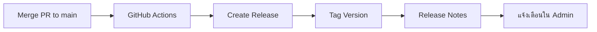

# 📦 คู่มือระบบอัปเดตเวอร์ชัน

ThaiPrompt Marketplace มีระบบตรวจสอบและแจ้งเตือนเวอร์ชันใหม่อัตโนมัติ โดยไม่ต้อง deploy อัตโนมัติ เพื่อให้ Admin มีการควบคุมการอัปเดตได้เอง

---

## 🎯 การทำงานของระบบ

### 1. เมื่อมีการ Merge เข้า Main Branch



เมื่อ admin ไปที่ **Admin Dashboard** → จะเห็นการแจ้งเตือนเวอร์ชันใหม่

### 2. Admin ตรวจสอบและอัปเดต

1. ดูรายละเอียดเวอร์ชันใหม่
2. อ่าน Release Notes และ Changelog
3. ตัดสินใจว่าจะอัปเดตหรือไม่
4. คลิกปุ่ม "อัปเดตตอนนี้"
5. ทำตามขั้นตอนที่ระบบแนะนำ

---

## 📋 ขั้นตอนการสร้าง Release ใหม่

### วิธีที่ 1: Merge Pull Request (แนะนำ)

```bash
# 1. สร้าง feature branch
git checkout -b feature/new-feature

# 2. ทำการพัฒนา feature
# ... code changes ...

# 3. Commit changes
git add .
git commit -m "feat: Add new feature"

# 4. Push to GitHub
git push origin feature/new-feature

# 5. Create Pull Request on GitHub
# 6. Merge PR to main

# → GitHub Actions จะสร้าง Release อัตโนมัติ!
```

### วิธีที่ 2: Push ตรงไปที่ Main

```bash
# 1. อัปเดต version ใน composer.json
# "version": "1.3.0"

# 2. Commit และ push
git add composer.json
git commit -m "chore: Bump version to 1.3.0"
git push origin main

# → GitHub Actions จะสร้าง Release อัตโนมัติ!
```

### วิธีที่ 3: Manual Release (ผ่าน GitHub Actions)

1. ไปที่ GitHub Repository
2. คลิก **Actions** tab
3. เลือก **Create Release** workflow
4. คลิก **Run workflow**
5. กรอก Version number (เช่น 1.3.0)
6. คลิก **Run**

---

## 🔍 การตรวจสอบเวอร์ชันใหม่

### ใน Admin Dashboard

เมื่อเข้า Admin Dashboard จะมีการแจ้งเตือนแบบ Banner ด้านบน:

```
┌────────────────────────────────────────────────────────┐
│ 🔔 มีเวอร์ชันใหม่พร้อมให้อัปเดต!                      │
│ เวอร์ชันปัจจุบัน: v1.1.0 → เวอร์ชันใหม่: v1.2.0       │
│ [ดูสิ่งที่เปลี่ยนแปลง] [อัปเดตตอนนี้] [ปิด]          │
└────────────────────────────────────────────────────────┘
```

### ในหน้า Version Update

ไปที่ **Admin > Version Update** เพื่อ:
- ดูเวอร์ชันปัจจุบัน
- ตรวจสอบเวอร์ชันใหม่
- ดู Changelog
- ดูประวัติการอัปเดต
- ดู GitHub Releases ทั้งหมด

---

## 🚀 ขั้นตอนการอัปเดต

### 1. เตรียมพร้อม

```bash
# Backup database
php artisan backup:run

# หรือ manual backup
mysqldump -u username -p database_name > backup_$(date +%Y%m%d).sql
```

### 2. เริ่มการอัปเดต

ใน Admin Panel:
1. คลิก "อัปเดตตอนนี้"
2. ระบบจะแสดงขั้นตอนการอัปเดต

### 3. ทำตามคำแนะนำ

```bash
# 1. Maintenance Mode
php artisan down

# 2. Pull latest code
git pull origin main

# 3. Install dependencies
composer install --optimize-autoloader --no-dev
npm install
npm run build

# 4. Run migrations
php artisan migrate --force

# 5. Clear cache
php artisan config:clear
php artisan route:clear
php artisan view:clear
php artisan cache:clear

# 6. Rebuild cache
php artisan config:cache
php artisan route:cache
php artisan view:cache

# 7. Restart queue workers
sudo supervisorctl restart thaiprompt-worker:*

# 8. Application back online
php artisan up
```

### 4. ยืนยันการอัปเดตเสร็จสิ้น

กลับไปที่ Admin Panel และคลิก "อัปเดตเสร็จสิ้น"

---

## ⚙️ การตั้งค่า

### ตั้งค่า GitHub Repository

แก้ไขใน database → `system_versions` table:

```sql
UPDATE system_versions
SET github_repo = 'username/repository-name'
WHERE id = 1;
```

หรือใน Admin > Settings > System:
- **GitHub Repository**: `username/repository-name`

### Auto-check for Updates

ระบบจะตรวจสอบเวอร์ชันใหม่อัตโนมัติทุกครั้งที่:
- Admin เข้า Dashboard
- Admin คลิก "Check for Updates"
- Scheduled task (ทุก 24 ชั่วโมง)

---

## 📊 ตัวอย่าง Release Notes

เมื่อสร้าง Release GitHub Actions จะสร้าง Release Notes อัตโนมัติ:

```markdown
## 🚀 What's New in v1.2.0

### Changes
- feat: Add Setup Wizard for easy installation
- feat: Add version update notification system
- fix: Improve database connection testing
- docs: Update deployment documentation

---

## 📦 Installation

### New Installation
1. Download the source code
2. Extract to your web server
3. Visit your domain - Setup Wizard will guide you

### Update from Previous Version
1. Login as Admin
2. Go to Admin > Version Update
3. Click "Check for Updates"
4. Follow the update instructions

---

## 📋 System Requirements
- PHP >= 8.1
- MySQL >= 8.0
- Redis (recommended)
- Composer
- Node.js & NPM
```

---

## 🔔 การแจ้งเตือน

### Banner Alert ใน Dashboard

แสดงเมื่อ:
- ✅ มีเวอร์ชันใหม่พร้อมอัปเดต
- ✅ แสดง current vs latest version
- ✅ แสดง changelog highlights
- ✅ ปุ่มอัปเดตด่วน
- ✅ สามารถปิดได้ (จะซ่อนจนกว่าจะมีเวอร์ชันใหม่กว่า)

### Email Notification (อนาคต)

จะส่งอีเมลแจ้งเตือน Admin เมื่อมีเวอร์ชันใหม่

---

## 🛠️ Troubleshooting

### ไม่เห็นการแจ้งเตือนเวอร์ชันใหม่

```bash
# ตรวจสอบ version ปัจจุบัน
php artisan tinker
>>> App\Models\SystemVersion::first()

# ตรวจสอบเวอร์ชันใหม่ manual
php artisan version:check

# หรือใน Admin > Version Update > Check for Updates
```

### การเชื่อมต่อ GitHub API ล้มเหลว

```php
// ตรวจสอบใน storage/logs/laravel.log

// แก้ไข: เพิ่ม GitHub Token (สำหรับ private repo)
// ในไฟล์ .env
GITHUB_TOKEN=your_github_personal_access_token
```

### Release ไม่ถูกสร้าง

```bash
# ตรวจสอบ GitHub Actions
# 1. ไปที่ Repository > Actions
# 2. ดู workflow runs
# 3. ตรวจสอบ logs

# สาเหตุที่พบบ่อย:
# - ไม่มีการเปลี่ยนแปลง version ใน composer.json
# - Workflow file ผิดพลาด
# - GitHub token expired
```

---

## 📈 Version History

ดูประวัติการอัปเดตใน Admin > Version Update > History:

| Version | Date | Updated By | Status |
|---------|------|------------|--------|
| v1.2.0 | 2025-10-27 | Admin | ✅ Completed |
| v1.1.0 | 2025-10-20 | Admin | ✅ Completed |
| v1.0.0 | 2025-10-01 | System | ✅ Initial |

---

## 🔐 Security

### Recommendations

- ✅ **Backup ก่อนทุกครั้ง**: สำคัญมาก!
- ✅ **ทดสอบบน Staging**: ทดสอบเวอร์ชันใหม่ก่อน
- ✅ **Maintenance Mode**: เปิดระหว่างอัปเดต
- ✅ **Check Logs**: ตรวจสอบ error logs หลังอัปเดต

### Best Practices

1. **Schedule Updates**: อัปเดตในช่วงเวลาที่มี traffic น้อย
2. **Notify Users**: แจ้งผู้ใช้ก่อนอัปเดต
3. **Monitor System**: ติดตามระบบหลังอัปเดต 30 นาทีแรก
4. **Rollback Plan**: เตรียมแผนกลับเวอร์ชันเดิมไว้

---

## 🎓 สำหรับ Developers

### การสร้าง Release แบบ Manual

```bash
# 1. สร้าง tag
git tag -a v1.3.0 -m "Release version 1.3.0"

# 2. Push tag
git push origin v1.3.0

# 3. สร้าง Release บน GitHub
gh release create v1.3.0 --title "Release v1.3.0" --notes "Release notes here"
```

### Semantic Versioning

ใช้ [SemVer](https://semver.org/):
- **MAJOR** (1.x.x): Breaking changes
- **MINOR** (x.1.x): New features (backward compatible)
- **PATCH** (x.x.1): Bug fixes

---

## 📞 Support

หากมีปัญหาในการอัปเดต:

- **Email**: support@thaiprompt.com
- **GitHub Issues**: https://github.com/xjanova/Thaiprompt-Affiliate/issues
- **Documentation**: https://docs.thaiprompt.com

---

## 🔗 Related Documents

- [DEPLOYMENT.md](./DEPLOYMENT.md) - Deployment guide
- [SETUP_WIZARD.md](./SETUP_WIZARD.md) - Setup wizard guide
- [INSTALLATION_GUIDE.md](./INSTALLATION_GUIDE.md) - Installation guide

---

**Version:** 1.2.0
**Last Updated:** 2025-10-27
