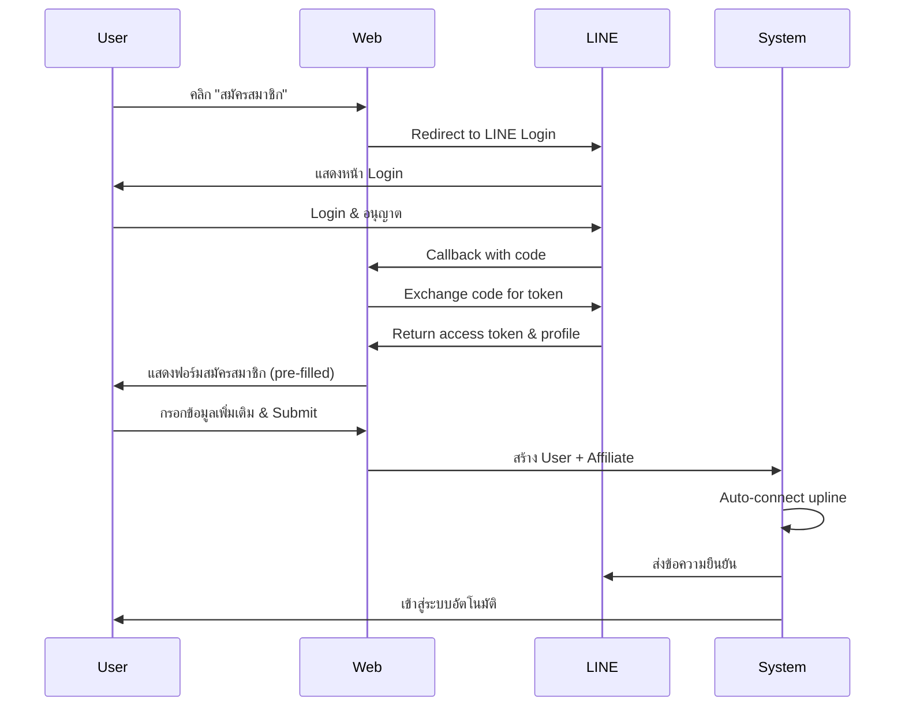

# คู่มือการตั้งค่า LINE Official Account Integration

คู่มือนี้จะแนะนำขั้นตอนการตั้งค่าระบบ LINE Official Account (LINE OA) สำหรับระบบ Affiliate ของคุณ

## สารบัญ

1. [ภาพรวม](#ภาพรวม)
2. [ขั้นตอนการตั้งค่า LINE Developers](#ขั้นตอนการตั้งค่า-line-developers)
3. [การตั้งค่าในระบบ Admin](#การตั้งค่าในระบบ-admin)
4. [การทดสอบระบบ](#การทดสอบระบบ)
5. [คำถามที่พบบ่อย](#คำถามที่พบบ่อย)

---

## ภาพรวม

ระบบ LINE OA Integration ประกอบด้วย:

### คุณสมบัติหลัก

✅ **LINE Login Authentication**
- ผู้ใช้สามารถเข้าสู่ระบบด้วยบัญชี LINE
- สามารถบังคับให้ต้อง login ด้วย LINE ก่อนสมัครสมาชิก (KYC Level 1)
- Auto-connect upline เมื่อสมัครผ่าน LINE

✅ **LINE Messaging API**
- ส่งข้อความต้อนรับเมื่อเพิ่มเพื่อน LINE OA
- ส่งข้อความยืนยันเมื่อสมัครสมาชิกสำเร็จ
- เก็บ LINE Access Token สำหรับส่งข้อความส่วนตัว
- รองรับ Flex Message สำหรับแสดงข้อมูลแบบสวยงาม

✅ **LINE Webhook**
- รับ event เมื่อมีคนเพิ่มเพื่อน (follow)
- รับ event เมื่อมีคนลบเพื่อน (unfollow)
- รับข้อความจากผู้ใช้และตอบกลับอัตโนมัติ

✅ **Admin Management**
- ตั้งค่า LINE Channel credentials
- กำหนดข้อความต้อนรับและข้อความสมัครสมาชิก
- ดูประวัติการใช้งาน LINE (logs)
- ทดสอบการส่งข้อความ

---

## ขั้นตอนการตั้งค่า LINE Developers

### 1. สร้าง LINE Developers Account

1. เข้าสู่ [LINE Developers Console](https://developers.line.biz/console/)
2. เข้าสู่ระบบด้วยบัญชี LINE ของคุณ
3. ยอมรับข้อตกลงการใช้งาน

### 2. สร้าง Provider

1. คลิก **"Create a new provider"**
2. กรอกชื่อ Provider (เช่น "My Company")
3. คลิก **"Create"**

### 3. สร้าง Channel สำหรับ LINE Login

1. ในหน้า Provider คลิก **"Create a new channel"**
2. เลือก **"LINE Login"**
3. กรอกข้อมูล:
   - **Channel name**: ชื่อที่จะแสดงเมื่อผู้ใช้ login
   - **Channel description**: คำอธิบาย
   - **App types**: เลือก **"Web app"**
   - **Email address**: อีเมลสำหรับติดต่อ
4. คลิก **"Create"**

### 4. ตั้งค่า LINE Login Channel

1. ไปที่แท็บ **"LINE Login"** ใน Channel settings
2. ตั้งค่า **Callback URL**:
   ```
   https://yourdomain.com/auth/line/callback
   ```
   > แทนที่ `yourdomain.com` ด้วย domain จริงของคุณ

3. **Bot prompt**: เลือก **"Aggressive"**
   - จะบังคับให้ผู้ใช้เพิ่มเพื่อน LINE OA เมื่อ login

4. คัดลอกข้อมูลต่อไปนี้:
   - **Channel ID**
   - **Channel secret** (คลิก "Issue" ถ้ายังไม่มี)

### 5. เปิดใช้งาน Messaging API (สำหรับส่งข้อความ)

1. ไปที่แท็บ **"Messaging API"**
2. คลิก **"Enable Messaging API"**
3. กรอกข้อมูล LINE Official Account:
   - **Official account name**: ชื่อบัญชี
   - **Industry**: เลือกอุตสาหกรรม
   - **Description**: คำอธิบาย
4. คลิก **"Create"**

### 6. ตั้งค่า Messaging API

1. ตั้งค่า **Webhook URL**:
   ```
   https://yourdomain.com/webhook/line
   ```

2. เปิดใช้งาน **"Use webhook"**: เปิด (ON)

3. **Auto-reply messages**: ปิด (OFF)
   - เพื่อให้ระบบของเราจัดการข้อความเอง

4. **Greeting messages**: ตั้งค่าตามต้องการ (optional)

5. สร้าง **Channel access token (long-lived)**:
   - คลิก **"Issue"**
   - คัดลอก token ที่ได้

### 7. เพิ่มสิทธิ์ Scopes

1. ไปที่แท็บ **"Scopes"**
2. ตรวจสอบว่ามี scopes ต่อไปนี้:
   - ✅ `profile`
   - ✅ `openid`
   - ✅ `email` (ถ้าต้องการอีเมล)

---

## การตั้งค่าในระบบ Admin

### 1. เข้าสู่หน้าตั้งค่า LINE OA

1. เข้าสู่ระบบ Admin Panel
2. ไปที่เมนู **"LINE OA Management"** หรือ `/admin/line-oa`

### 2. กรอกข้อมูล LINE Channel

กรอกข้อมูลที่ได้จาก LINE Developers Console:

| ฟิลด์ | คำอธิบาย | จำเป็น |
|------|----------|--------|
| **Channel ID** | Channel ID จาก LINE Developers | ✅ |
| **Channel Secret** | Channel Secret จาก LINE Developers | ✅ |
| **Channel Access Token** | Long-lived access token สำหรับส่งข้อความ | สำหรับส่งข้อความ |
| **LIFF ID** | LIFF ID (ถ้าใช้ LIFF) | ไม่จำเป็น |

### 3. ตั้งค่าการสมัครสมาชิก

- ☑️ **บังคับให้เข้าสู่ระบบด้วย LINE ก่อนสมัครสมาชิก**
  - เมื่อเปิด: ผู้ใช้จะต้อง login ด้วย LINE ก่อนจึงจะสมัครได้
  - ใช้เป็น KYC Level 1

### 4. ตั้งค่าการส่งข้อความ

- ☑️ **เปิดใช้งานการส่งข้อความผ่าน LINE**

- **ข้อความต้อนรับ** (เมื่อเพิ่มเพื่อน):
  ```
  ยินดีต้อนรับสู่ระบบ Affiliate! ขอบคุณที่เพิ่มเพื่อนกับเรา

  คุณสามารถสมัครสมาชิกได้ที่เว็บไซต์ของเรา
  ```

- **ข้อความเมื่อสมัครสำเร็จ**:
  ```
  🎉 สมัครสมาชิกสำเร็จ!

  ยินดีต้อนรับสู่ระบบ Affiliate ของเรา

  ชื่อ: {name}
  อีเมล: {email}
  รหัสแนะนำ: {referral_code}

  คุณสามารถเข้าสู่ระบบและเริ่มต้นสร้างรายได้ได้ทันที!
  ```

  > **ตัวแปรที่ใช้ได้**: `{name}`, `{email}`, `{referral_code}`

### 5. เปิดใช้งานระบบ

- ☑️ **เปิดใช้งานระบบ LINE OA**

คลิก **"บันทึกการตั้งค่า"**

---

## การทดสอบระบบ

### 1. ทดสอบ LINE Login

1. เปิดหน้า Registration หรือ Login ของเว็บไซต์
2. คลิกปุ่ม **"เข้าสู่ระบบด้วย LINE"**
3. จะถูก redirect ไปหน้า LINE Login
4. เข้าสู่ระบบและยอมรับการเพิ่มเพื่อน
5. ตรวจสอบว่ากลับมาหน้าเว็บไซต์และเข้าสู่ระบบสำเร็จ

### 2. ทดสอบการส่งข้อความ

1. ในหน้า Admin LINE OA Settings
2. เลื่อนลงไปที่ **"ทดสอบการส่งข้อความ"**
3. คลิก **"แสดงฟอร์มทดสอบ"**
4. กรอก:
   - **LINE User ID**: หา User ID จาก LINE Profile หรือ logs
   - **ข้อความทดสอบ**: พิมพ์ข้อความที่ต้องการส่ง
5. คลิก **"ส่งข้อความทดสอบ"**
6. ตรวจสอบข้อความใน LINE

### 3. ตรวจสอบ Webhook

1. ส่งข้อความไปที่ LINE OA
2. ตรวจสอบว่าได้รับ response หรือไม่
3. ลองพิมพ์ **"info"** หรือ **"ข้อมูล"** เพื่อขอข้อมูลบัญชี

### 4. ดู Logs

1. ไปที่ **"ประวัติการใช้งาน LINE"** (Logs)
2. ตรวจสอบ logs การ login, register
3. ดูข้อมูลรายละเอียดใน metadata

---

## Flow การทำงาน

### การสมัครสมาชิกด้วย LINE



### การส่งข้อความ

1. เมื่อผู้ใช้สมัครสำเร็จ → ส่งข้อความยืนยัน
2. เมื่อมีคนเพิ่มเพื่อน → ส่งข้อความต้อนรับ
3. เมื่อผู้ใช้ส่งข้อความมา → ตอบกลับตาม command

---

## คำถามที่พบบ่อย (FAQ)

### Q: ทำไมต้องใช้ Channel Access Token แบบ long-lived?

**A:** เพื่อให้สามารถส่งข้อความหาผู้ใช้ได้ตลอดเวลา โดยไม่ต้อง refresh token บ่อยๆ

---

### Q: ต่างระหว่าง LINE Login กับ LINE Messaging API อย่างไร?

**A:**
- **LINE Login**: ใช้สำหรับการ authenticate ผู้ใช้ (เข้าสู่ระบบ)
- **LINE Messaging API**: ใช้สำหรับส่งข้อความหาผู้ใช้

---

### Q: จะหา LINE User ID ได้อย่างไร?

**A:** มี 3 วิธี:
1. ดูจาก Admin > LINE OA > Logs
2. ดูจากฐานข้อมูล table `users` column `line_user_id`
3. ใช้ LINE Developers Console > Messaging API > Check user info

---

### Q: Webhook ไม่ทำงาน

**A:** ตรวจสอบ:
1. ✅ Webhook URL ถูกต้อง (https://yourdomain.com/webhook/line)
2. ✅ เปิดใช้งาน "Use webhook" ใน LINE Developers
3. ✅ Channel secret ถูกต้อง (ใช้ verify signature)
4. ✅ SSL certificate ถูกต้อง (LINE ต้องการ HTTPS)

ดู webhook logs ใน LINE Developers Console

---

### Q: ผู้ใช้ไม่ได้รับข้อความ

**A:** ตรวจสอบ:
1. ✅ ผู้ใช้ได้เพิ่มเพื่อน LINE OA แล้ว
2. ✅ Channel Access Token ถูกต้อง
3. ✅ เปิดใช้งาน "enable_line_messaging"
4. ✅ LINE User ID ถูกบันทึกในระบบ
5. ✅ ไม่ถูก block โดย LINE (rate limit)

---

### Q: จะทดสอบในโหมด Development ได้อย่างไร?

**A:** ใช้ [ngrok](https://ngrok.com/) สำหรับ expose localhost:
```bash
ngrok http 8000
```
จากนั้นใช้ URL ที่ได้เป็น Callback URL และ Webhook URL

---

### Q: สามารถส่งข้อความประเภทอื่นได้ไหม? (นอกจาก text)

**A:** ได้! ระบบรองรับ:
- Text messages
- Flex messages (card, carousel)
- Image messages
- Video messages
- Audio messages

ดูตัวอย่างใน `app/Services/LineService.php` method `sendUserInfoCard()`

---

## การ Troubleshooting

### ปัญหา: "Invalid state parameter"

**สาเหตุ**: Session expired หรือ CSRF attack
**แก้ไข**: ล้าง cookies และลองใหม่

---

### ปัญหา: "Callback URL mismatch"

**สาเหตุ**: Callback URL ไม่ตรงกับที่ตั้งไว้ใน LINE Developers
**แก้ไข**: ตรวจสอบ URL ให้ตรงกัน (รวม https:// และ trailing slash)

---

### ปัญหา: "Channel access token expired"

**สาเหตุ**: ใช้ token แบบ short-lived
**แก้ไข**: สร้าง channel access token แบบ long-lived ใหม่

---

## ข้อมูลเพิ่มเติม

### เอกสารอ้างอิง

- [LINE Login Documentation](https://developers.line.biz/en/docs/line-login/)
- [Messaging API Documentation](https://developers.line.biz/en/docs/messaging-api/)
- [Flex Message Simulator](https://developers.line.biz/flex-simulator/)
- [LINE Developers Console](https://developers.line.biz/console/)

### ตัวอย่าง Code

ดูตัวอย่าง code ได้ที่:
- `app/Services/LineService.php` - LINE API service
- `app/Http/Controllers/Auth/LineLoginController.php` - LINE login flow
- `app/Http/Controllers/LineWebhookController.php` - Webhook handler

---

## สรุป

ระบบ LINE OA Integration นี้จะช่วยให้:

✅ ผู้ใช้สมัครสมาชิกง่ายและรวดเร็วขึ้น
✅ มั่นใจได้ว่าผู้ใช้เป็นบุคคลจริง (KYC Level 1)
✅ สามารถติดต่อผู้ใช้ผ่าน LINE ได้ทันที
✅ Auto-connect upline โดยอัตโนมัติ
✅ เพิ่มอัตราการ conversion

**ขั้นตอนสำคัญ:**
1. ตั้งค่า LINE Developers (Channel ID, Secret, Token)
2. ตั้งค่าใน Admin Panel
3. ทดสอบระบบ
4. เปิดใช้งาน

หากมีปัญหาหรือข้อสงสัย กรุณาติดต่อทีม Support
