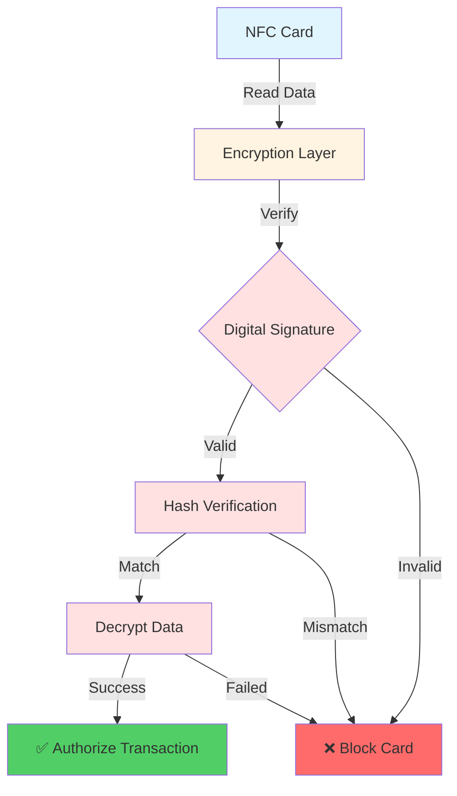

# 💳 NFC Card Payment System

> ระบบชำระเงินด้วยบัตร NFC แบบครบวงจร พร้อมระบบเข้ารหัสแบบสองทางเพื่อป้องกันบัตรปลอม

[](https://github.com/xjanova/Thaiprompt-Affiliate)
[](https://laravel.com)
[](https://php.net)
[](LICENSE)

---

## 📋 Table of Contents

- [Overview](#-overview)
- [Features](#-features)
- [Architecture](#-architecture)
- [Installation](#-installation)
- [Admin Guide](#-admin-guide)
- [API Reference](#-api-reference)
- [Security](#-security)
- [UI Components](#-ui-components)
- [Troubleshooting](#-troubleshooting)
- [FAQ](#-faq)

---

## 🎯 Overview

ระบบ NFC Card Payment เป็นระบบชำระเงินที่ทันสมัยและปลอดภัย ออกแบบมาเพื่อรองรับการชำระเงินด้วยบัตร NFC พร้อมระบบป้องกันบัตรปลอมที่แข็งแกร่ง

### Why NFC Card Payment?

- ✅ **รวดเร็ว** - แตะบัตรเพียงครั้งเดียว ชำระเงินสำเร็จใน 1 วินาที
- 🔒 **ปลอดภัย** - เข้ารหัสแบบสองทาง AES-256-CBC พร้อม Digital Signature
- 🎯 **แม่นยำ** - ป้องกันบัตรปลอมด้วยระบบ Two-Way Verification
- 📱 **ทันสมัย** - รองรับ Mobile App และ POS Terminal
- 📊 **ครบครัน** - Dashboard, Analytics, และ Reports แบบ Real-time

### Key Statistics

```
📊 System Capacity
├── 🎫 Cards: Unlimited
├── 🖨️ Readers: Unlimited
├── 💰 Transactions: 1000+ TPS
├── 🔐 Security: Military-grade encryption
└── ⚡ Speed: <100ms per transaction
```

---

## 🚀 Features

### 1️⃣ Card Management

<table>
<tr>
<td width="50%">

#### 🎫 Card Operations
- Issue new NFC cards
- Pair cards with users
- Multi-card type support
  - 🥉 Standard
  - 🥈 Premium
  - 🥇 VIP
- Balance management
- Card blocking/unblocking
- Auto-block on failed attempts

</td>
<td width="50%">

#### 👥 User Integration
- Seamless user pairing
- One-to-many relationship
- User profile integration
- Transaction history
- Balance tracking
- Credit limit control

</td>
</tr>
</table>

### 2️⃣ Reader Management

```
📡 NFC Reader Features
├── 📍 Location tracking
├── 💚 Online/Offline monitoring
├── 💓 Heartbeat system (every 5 min)
├── 📊 Transaction statistics
├── 🔧 Maintenance mode
└── 🔐 Secure authentication
```

### 3️⃣ Transaction Processing

| Feature | Description | Status |
|---------|-------------|--------|
| **Payment** | Deduct from card balance | ✅ Ready |
| **Top-up** | Add funds to card | ✅ Ready |
| **Refund** | Return funds | ✅ Ready |
| **Transfer** | Card-to-card transfer | ✅ Ready |
| **Verification** | Check card validity | ✅ Ready |

### 4️⃣ Security Features

<div align="center">



</div>

#### Security Layers

1. **🔐 Encryption** - AES-256-CBC with random IV
2. **✍️ Digital Signature** - HMAC-SHA256 signing
3. **#️⃣ Hash Verification** - Data integrity check
4. **🔑 Key Management** - Secure key storage & rotation
5. **🚫 Anti-Fraud** - Auto-block after 3 failed attempts
6. **⏰ Timestamp** - Prevent replay attacks

---

## 🏗️ Architecture

### System Components

```
┌─────────────────────────────────────────────────────────────┐
│                    NFC Card Payment System                   │
├─────────────────────────────────────────────────────────────┤
│                                                               │
│  ┌──────────────┐  ┌──────────────┐  ┌──────────────┐      │
│  │   Database   │  │   Business   │  │     API      │      │
│  │    Layer     │◄─┤     Logic    │◄─┤    Layer     │      │
│  │              │  │     Layer    │  │              │      │
│  └──────────────┘  └──────────────┘  └──────────────┘      │
│         ▲                  ▲                  ▲             │
│         │                  │                  │             │
│  ┌──────┴──────┐  ┌────────┴────────┐  ┌─────┴──────┐     │
│  │ Migrations  │  │    Services     │  │Controllers │     │
│  │             │  │                 │  │            │     │
│  │ • Readers   │  │ • Encryption    │  │ • Admin    │     │
│  │ • Cards     │  │ • Card Service  │  │ • API      │     │
│  │ • Trans     │  │ • Payment Prov  │  │            │     │
│  └─────────────┘  └─────────────────┘  └────────────┘     │
│                                                               │
└─────────────────────────────────────────────────────────────┘
```

### Database Schema

<details>
<summary>📊 Click to view complete database schema</summary>

```sql
-- NFC Readers Table
CREATE TABLE nfc_readers (
    id BIGINT PRIMARY KEY,
    name VARCHAR(255),
    reader_id VARCHAR(255) UNIQUE,
    serial_number VARCHAR(255) UNIQUE,
    location VARCHAR(255),
    ip_address VARCHAR(45),
    mac_address VARCHAR(17),
    status ENUM('active', 'inactive', 'maintenance'),
    last_heartbeat TIMESTAMP,
    created_at TIMESTAMP,
    updated_at TIMESTAMP
);

-- NFC Cards Table
CREATE TABLE nfc_cards (
    id BIGINT PRIMARY KEY,
    card_number VARCHAR(255) UNIQUE,
    card_name VARCHAR(255),
    user_id BIGINT,

    -- Encryption Data
    encrypted_data TEXT,
    encryption_key_hash VARCHAR(255),
    card_signature VARCHAR(255),
    encryption_version INT DEFAULT 1,

    -- Card Info
    card_type ENUM('standard', 'premium', 'vip'),
    balance DECIMAL(15,2) DEFAULT 0,
    credit_limit DECIMAL(15,2) DEFAULT 0,

    -- Status
    status ENUM('active', 'inactive', 'blocked', 'expired', 'pending'),
    is_paired BOOLEAN DEFAULT FALSE,

    -- Security
    failed_attempts INT DEFAULT 0,
    blocked_until TIMESTAMP,

    created_at TIMESTAMP,
    updated_at TIMESTAMP,
    FOREIGN KEY (user_id) REFERENCES users(id)
);

-- NFC Transactions Table
CREATE TABLE nfc_transactions (
    id BIGINT PRIMARY KEY,
    transaction_id VARCHAR(255) UNIQUE,
    nfc_card_id BIGINT,
    user_id BIGINT,
    nfc_reader_id BIGINT,

    -- Transaction Details
    type ENUM('payment', 'topup', 'refund', 'transfer', 'verification'),
    amount DECIMAL(15,2),
    balance_before DECIMAL(15,2),
    balance_after DECIMAL(15,2),

    -- Status
    status ENUM('pending', 'processing', 'completed', 'failed', 'cancelled'),

    -- Verification
    card_data_hash TEXT,
    encryption_verified BOOLEAN DEFAULT FALSE,

    -- Metadata
    receipt_number VARCHAR(255) UNIQUE,
    location VARCHAR(255),

    created_at TIMESTAMP,
    updated_at TIMESTAMP,

    FOREIGN KEY (nfc_card_id) REFERENCES nfc_cards(id),
    FOREIGN KEY (user_id) REFERENCES users(id),
    FOREIGN KEY (nfc_reader_id) REFERENCES nfc_readers(id)
);
```

</details>

### File Structure

```
📁 NFC Card Payment System
│
├── 📂 database/migrations/
│   ├── 2025_11_13_000001_create_nfc_readers_table.php
│   ├── 2025_11_13_000002_create_nfc_cards_table.php
│   └── 2025_11_13_000003_create_nfc_transactions_table.php
│
├── 📂 app/Models/
│   ├── NFCCard.php
│   ├── NFCReader.php
│   └── NFCTransaction.php
│
├── 📂 app/Services/NFC/
│   ├── NFCCardEncryptionService.php
│   └── NFCCardService.php
│
├── 📂 app/Services/Payment/
│   └── NFCCardProvider.php
│
├── 📂 app/Http/Controllers/Admin/
│   ├── NFCCardController.php
│   ├── NFCReaderController.php
│   └── NFCTransactionController.php
│
├── 📂 app/Http/Controllers/Api/
│   └── NFCCardApiController.php
│
├── 📂 routes/
│   ├── admin.php (updated)
│   └── api.php (updated)
│
└── 📂 docs/
    └── NFC_CARD_PAYMENT_SYSTEM.md (this file)
```

---

## 📦 Installation

### Prerequisites

- PHP >= 8.2
- Laravel >= 11.x
- MySQL >= 8.0 or MariaDB >= 10.6
- Redis (for caching)
- NFC Reader hardware (optional for testing)

### Step 1: Run Migrations

```bash
# Run database migrations
php artisan migrate

# Check migration status
php artisan migrate:status
```

Expected output:
```
✅ 2025_11_13_000001_create_nfc_readers_table
✅ 2025_11_13_000002_create_nfc_cards_table
✅ 2025_11_13_000003_create_nfc_transactions_table
```

### Step 2: Clear Cache

```bash
# Clear all caches
php artisan cache:clear
php artisan config:clear
php artisan route:clear
php artisan view:clear

# Rebuild optimizations
php artisan optimize
```

### Step 3: Create Admin Views

สร้างไฟล์ Blade views ตามโครงสร้างนี้:

```
resources/views/admin/
├── nfc-cards/
│   ├── index.blade.php    (Card listing)
│   ├── create.blade.php   (Issue new card)
│   ├── show.blade.php     (Card details)
│   ├── edit.blade.php     (Edit card)
│   ├── pair.blade.php     (Pair with user)
│   └── topup.blade.php    (Top up balance)
│
├── nfc-readers/
│   ├── index.blade.php    (Reader listing)
│   ├── create.blade.php   (Add reader)
│   ├── show.blade.php     (Reader details)
│   └── edit.blade.php     (Edit reader)
│
└── nfc-transactions/
    ├── index.blade.php    (Transaction listing)
    └── show.blade.php     (Transaction details)
```

### Step 4: Add Menu Items

เพิ่มเมนูใน Admin Sidebar:

```blade
<!-- resources/views/layouts/admin.blade.php -->

<li class="menu-section">
    <h4 class="menu-text">NFC Payment</h4>
</li>

<li class="menu-item {{ request()->routeIs('admin.nfc-cards.*') ? 'active' : '' }}">
    <a href="{{ route('admin.nfc-cards.index') }}" class="menu-link">
        <i class="menu-icon fas fa-credit-card"></i>
        <span class="menu-text">NFC Cards</span>
        @if($unpairedCardsCount > 0)
            <span class="badge badge-warning">{{ $unpairedCardsCount }}</span>
        @endif
    </a>
</li>

<li class="menu-item {{ request()->routeIs('admin.nfc-readers.*') ? 'active' : '' }}">
    <a href="{{ route('admin.nfc-readers.index') }}" class="menu-link">
        <i class="menu-icon fas fa-barcode-read"></i>
        <span class="menu-text">NFC Readers</span>
        <span class="badge badge-success">{{ $onlineReadersCount }}</span>
    </a>
</li>

<li class="menu-item {{ request()->routeIs('admin.nfc-transactions.*') ? 'active' : '' }}">
    <a href="{{ route('admin.nfc-transactions.index') }}" class="menu-link">
        <i class="menu-icon fas fa-exchange-alt"></i>
        <span class="menu-text">NFC Transactions</span>
    </a>
</li>
```

### Step 5: Verify Installation

```bash
# Check routes
php artisan route:list | grep nfc

# Test database connection
php artisan tinker
>>> App\Models\NFCCard::count();
=> 0
>>> App\Models\NFCReader::count();
=> 0
```

---

## 👨‍💼 Admin Guide

### Dashboard Overview

เมื่อเข้า Admin Panel คุณจะพบ:

```
╔══════════════════════════════════════════════════════════╗
║              NFC Card Payment Dashboard                  ║
╠══════════════════════════════════════════════════════════╣
║                                                          ║
║  📊 Statistics                                           ║
║  ┌──────────┬──────────┬──────────┬──────────┐         ║
║  │ Total    │ Active   │ Paired   │ Blocked  │         ║
║  │ Cards    │ Cards    │ Cards    │ Cards    │         ║
║  │   150    │   142    │   138    │    5     │         ║
║  └──────────┴──────────┴──────────┴──────────┘         ║
║                                                          ║
║  💰 Total Balance: ฿1,245,680.00                        ║
║  📈 Today's Transactions: 1,234                          ║
║  💳 Today's Revenue: ฿89,450.00                          ║
║                                                          ║
╚══════════════════════════════════════════════════════════╝
```

### Managing NFC Cards

#### 1. Issue New Card

Navigate to: **Admin → NFC Cards → Create**

```
┌─────────────────────────────────────────┐
│      Issue New NFC Card                 │
├─────────────────────────────────────────┤
│                                         │
│ Card Number: [________________]         │
│ (Read from NFC card)                    │
│                                         │
│ Card Name: [________________]           │
│ (Optional display name)                 │
│                                         │
│ Card Type: [ Standard ▼ ]              │
│                                         │
│ Initial Balance: [0.00] THB            │
│                                         │
│ Credit Limit: [0.00] THB               │
│                                         │
│ Expires At: [2030-01-01]               │
│                                         │
│ Notes: [___________________________]    │
│       [___________________________]    │
│                                         │
│  [Cancel]         [Issue Card]         │
└─────────────────────────────────────────┘
```

#### 2. Pair Card with User

Navigate to: **Card Details → Pair**

```
┌─────────────────────────────────────────┐
│      Pair Card with User                │
├─────────────────────────────────────────┤
│                                         │
│ Card: 1234********5678                  │
│ Status: ⚠️  Unpaired                    │
│                                         │
│ Select User:                            │
│ ┌─────────────────────────────┐        │
│ │ 🔍 Search user...            │        │
│ └─────────────────────────────┘        │
│                                         │
│ Available Users:                        │
│ ┌─────────────────────────────┐        │
│ │ ○ John Doe (john@example.com)│       │
│ │ ○ Jane Smith (jane@example.c)│       │
│ │ ○ Bob Wilson (bob@example.co)│       │
│ └─────────────────────────────┘        │
│                                         │
│  [Cancel]         [Pair Card]          │
└─────────────────────────────────────────┘
```

#### 3. Top Up Balance

Navigate to: **Card Details → Top Up**

```
┌─────────────────────────────────────────┐
│      Top Up Card Balance                │
├─────────────────────────────────────────┤
│                                         │
│ Card: 1234********5678                  │
│ Owner: John Doe                         │
│ Current Balance: ฿1,250.00              │
│                                         │
│ Amount: [_______] THB                   │
│                                         │
│ Quick Amounts:                          │
│ [ 100 ] [ 500 ] [ 1000 ] [ 5000 ]     │
│                                         │
│ Notes: [___________________________]    │
│                                         │
│ New Balance: ฿1,250.00 + ฿500.00       │
│            = ฿1,750.00                  │
│                                         │
│  [Cancel]         [Top Up]             │
└─────────────────────────────────────────┘
```

### Managing NFC Readers

#### Add New Reader

Navigate to: **Admin → NFC Readers → Create**

```
┌─────────────────────────────────────────┐
│      Add NFC Reader                     │
├─────────────────────────────────────────┤
│                                         │
│ Reader Name: [________________]         │
│                                         │
│ Reader ID: [________________]           │
│ (Unique device ID)                      │
│                                         │
│ Serial Number: [________________]       │
│                                         │
│ Location: [________________]            │
│ (e.g., Shop A, Counter 1)              │
│                                         │
│ IP Address: [192.168.1.100]            │
│                                         │
│ MAC Address: [00:11:22:33:44:55]       │
│                                         │
│ Description: [______________________]   │
│             [______________________]   │
│                                         │
│  [Cancel]         [Add Reader]         │
└─────────────────────────────────────────┘
```

### Monitoring Transactions

Navigate to: **Admin → NFC Transactions**

```
╔════════════════════════════════════════════════════════════════╗
║                 Transaction Monitoring                          ║
╠════════════════════════════════════════════════════════════════╣
║                                                                 ║
║ Filters: [Status ▼] [Type ▼] [Date Range] [🔍 Search]        ║
║                                                                 ║
║ ┌────────────────────────────────────────────────────────────┐ ║
║ │ Transaction │ Card     │ Amount  │ Type   │ Status  │ Time │ ║
║ ├────────────────────────────────────────────────────────────┤ ║
║ │ NFC123...   │ 1234*5678│ ฿150.00 │ Payment│ ✅ Done │ 10:30│ ║
║ │ NFC124...   │ 5678*1234│ ฿500.00 │ Top-up │ ✅ Done │ 10:28│ ║
║ │ NFC125...   │ 9012*3456│ ฿75.50  │ Payment│ ✅ Done │ 10:25│ ║
║ │ NFC126...   │ 3456*7890│ ฿200.00 │ Refund │ ⏳ Proc │ 10:23│ ║
║ └────────────────────────────────────────────────────────────┘ ║
║                                                                 ║
║ 📊 Real-time Stats:                                            ║
║ Today: 1,234 trans | ฿89,450.00 | Success Rate: 99.8%         ║
║                                                                 ║
╚════════════════════════════════════════════════════════════════╝
```

---

## 📡 API Reference

### Base URL

```
Production:  https://yourdomain.com/api/v1
Development: http://localhost/api/v1
```

### Authentication

ทุก API endpoint ต้องใช้ Bearer Token:

```http
Authorization: Bearer {your-sanctum-token}
```

### Endpoints

#### 1. Get User's Cards

```http
GET /api/v1/nfc/cards
```

**Response:**
```json
{
    "success": true,
    "data": [
        {
            "id": 1,
            "card_number_masked": "1234********5678",
            "card_name": "My Primary Card",
            "card_type": "premium",
            "card_type_label": "พรีเมียม",
            "balance": 1250.00,
            "status": "active",
            "status_label": "ใช้งานได้",
            "is_active": true,
            "expires_at": "2030-01-01T00:00:00.000000Z",
            "last_used_at": "2025-11-13T10:30:00.000000Z"
        }
    ]
}
```

#### 2. Verify Card

```http
POST /api/v1/nfc/cards/verify
Content-Type: application/json

{
    "card_number": "1234567890123456",
    "encrypted_data": "base64_encoded_encrypted_data"
}
```

**Response (Success):**
```json
{
    "success": true,
    "verified": true,
    "data": {
        "card_id": 1,
        "card_number_masked": "1234********5678",
        "balance": 1250.00,
        "card_type": "premium",
        "status": "active",
        "is_active": true
    }
}
```

**Response (Failed):**
```json
{
    "success": false,
    "verified": false,
    "error": "Invalid card signature - fake card detected"
}
```

#### 3. Process Payment

```http
POST /api/v1/nfc/cards/payment
Content-Type: application/json

{
    "card_id": 1,
    "amount": 150.00,
    "reader_id": 5,
    "encrypted_data": "base64_encoded_encrypted_data",
    "metadata": {
        "order_id": "ORD-12345",
        "description": "Purchase at Shop A"
    }
}
```

**Response:**
```json
{
    "success": true,
    "data": {
        "transaction_id": "NFCABC1234567890",
        "receipt_number": "RCP20251113001234",
        "amount": 150.00,
        "balance_before": 1250.00,
        "balance_after": 1100.00,
        "status": "completed",
        "completed_at": "2025-11-13T10:30:00.000000Z"
    }
}
```

#### 4. Get Card Transactions

```http
GET /api/v1/nfc/cards/{cardId}/transactions?limit=20
```

**Response:**
```json
{
    "success": true,
    "data": [
        {
            "transaction_id": "NFCABC1234567890",
            "receipt_number": "RCP20251113001234",
            "type": "payment",
            "type_label": "ชำระเงิน",
            "amount": 150.00,
            "balance_before": 1250.00,
            "balance_after": 1100.00,
            "status": "completed",
            "status_label": "สำเร็จ",
            "location": "Shop A",
            "reader_name": "POS Terminal 1",
            "created_at": "2025-11-13T10:30:00.000000Z",
            "completed_at": "2025-11-13T10:30:01.000000Z"
        }
    ]
}
```

#### 5. Get Card Balance

```http
GET /api/v1/nfc/cards/{cardId}/balance
```

**Response:**
```json
{
    "success": true,
    "data": {
        "balance": 1100.00,
        "credit_limit": 5000.00,
        "currency": "THB"
    }
}
```

#### 6. Get Nearby Readers

```http
GET /api/v1/nfc/readers/nearby
```

**Response:**
```json
{
    "success": true,
    "data": [
        {
            "id": 1,
            "reader_id": "RDR-001",
            "name": "POS Terminal 1",
            "location": "Shop A, Counter 1",
            "status": "active",
            "is_online": true
        },
        {
            "id": 2,
            "reader_id": "RDR-002",
            "name": "POS Terminal 2",
            "location": "Shop A, Counter 2",
            "status": "active",
            "is_online": true
        }
    ]
}
```

### Error Responses

```json
{
    "success": false,
    "error": "Error message here"
}
```

**Common Error Codes:**

| Code | Message | Description |
|------|---------|-------------|
| 400 | Bad Request | Invalid parameters |
| 401 | Unauthorized | Invalid or missing token |
| 403 | Forbidden | Card doesn't belong to user |
| 404 | Not Found | Card/Reader not found |
| 422 | Validation Error | Invalid input data |
| 500 | Server Error | Internal server error |

---

## 🔐 Security

### Encryption Flow

```
┌─────────────────────────────────────────────────────────────┐
│                    ENCRYPTION PROCESS                        │
└─────────────────────────────────────────────────────────────┘

Step 1: Generate Key
┌──────────────────────┐
│ Random 256-bit Key   │
│ Base64 Encoded       │
└──────────────────────┘
           │
           ▼
Step 2: Prepare Data
┌──────────────────────┐
│ Card Data + Metadata │
│ + Timestamp + Nonce  │
└──────────────────────┘
           │
           ▼
Step 3: Encrypt
┌──────────────────────┐
│ AES-256-CBC          │
│ Random IV            │
└──────────────────────┘
           │
           ▼
Step 4: Generate Hash
┌──────────────────────┐
│ HMAC-SHA256          │
│ Data Integrity       │
└──────────────────────┘
           │
           ▼
Step 5: Sign
┌──────────────────────┐
│ Digital Signature    │
│ Anti-Tampering       │
└──────────────────────┘
           │
           ▼
Step 6: Write to Card
┌──────────────────────┐
│ Encrypted Package    │
│ Ready for NFC Write  │
└──────────────────────┘
```

### Verification Flow

```
┌─────────────────────────────────────────────────────────────┐
│                   VERIFICATION PROCESS                       │
└─────────────────────────────────────────────────────────────┘

Step 1: Read Card
┌──────────────────────┐
│ NFC Reader Scans     │
│ Encrypted Data       │
└──────────────────────┘
           │
           ▼
Step 2: Verify Signature
┌──────────────────────┐
│ Check Digital Sign   │
│ ✅ Valid / ❌ Invalid│
└──────────────────────┘
           │
           ▼ (if valid)
Step 3: Verify Hash
┌──────────────────────┐
│ Check Data Integrity │
│ ✅ Match / ❌ Mismatch│
└──────────────────────┘
           │
           ▼ (if match)
Step 4: Decrypt
┌──────────────────────┐
│ AES-256-CBC Decrypt  │
│ Extract Card Data    │
└──────────────────────┘
           │
           ▼
Step 5: Validate
┌──────────────────────┐
│ • Check Timestamp    │
│ • Check Version      │
│ • Check User ID      │
└──────────────────────┘
           │
           ▼
Step 6: Authorize
┌──────────────────────┐
│ ✅ Transaction OK    │
│ 💳 Process Payment   │
└──────────────────────┘
```

### Security Best Practices

#### 🔒 For Administrators

1. **Key Management**
   ```bash
   # Store encryption keys securely
   # Never commit keys to version control
   # Use environment variables
   APP_KEY=base64:your-app-key-here
   ```

2. **Access Control**
   - Limit admin access to NFC management
   - Use role-based permissions
   - Log all administrative actions

3. **Reader Security**
   - Change default passwords
   - Use VPN for remote readers
   - Monitor heartbeat regularly

4. **Card Issuance**
   - Verify user identity before pairing
   - Set appropriate credit limits
   - Document all card issues

#### 🔐 For Developers

1. **Encryption**
   ```php
   // Always use the service
   $encryptionService = app(NFCCardEncryptionService::class);

   // Never hardcode keys
   // ❌ BAD
   $key = 'my-secret-key';

   // ✅ GOOD
   $key = $encryptionService->generateEncryptionKey();
   ```

2. **Validation**
   ```php
   // Always validate input
   $validated = $request->validate([
       'card_number' => 'required|string',
       'encrypted_data' => 'required|string',
   ]);

   // Verify card authenticity
   $verification = $encryptionService->verifyCardAuthenticity(...);
   if (!$verification['valid']) {
       throw new Exception('Invalid card');
   }
   ```

3. **Error Handling**
   ```php
   // Don't expose sensitive info
   // ❌ BAD
   catch (Exception $e) {
       return response()->json(['error' => $e->getMessage()]);
   }

   // ✅ GOOD
   catch (Exception $e) {
       Log::error('Card verification failed', ['error' => $e]);
       return response()->json(['error' => 'Verification failed']);
   }
   ```

---

## 🎨 UI Components

### Dashboard Card

```blade
<div class="card bg-gradient-primary text-white mb-4">
    <div class="card-body">
        <div class="d-flex justify-content-between align-items-center">
            <div>
                <h6 class="text-white-50 mb-1">Total Cards</h6>
                <h2 class="mb-0">{{ number_format($totalCards) }}</h2>
            </div>
            <div class="icon">
                <i class="fas fa-credit-card fa-3x opacity-50"></i>
            </div>
        </div>
        <div class="mt-3 pt-3 border-top border-white-15">
            <span class="badge badge-light">
                <i class="fas fa-arrow-up"></i> 12% from last month
            </span>
        </div>
    </div>
</div>
```

### Card Status Badge

```blade
@php
$badgeClass = match($card->status) {
    'active' => 'badge-success',
    'blocked' => 'badge-danger',
    'pending' => 'badge-warning',
    'inactive' => 'badge-secondary',
    'expired' => 'badge-dark',
    default => 'badge-secondary'
};
@endphp

<span class="badge {{ $badgeClass }}">
    <i class="fas fa-circle mr-1"></i>
    {{ $card->status_label }}
</span>
```

### Transaction Timeline

```blade
<div class="timeline">
    @foreach($transactions as $transaction)
    <div class="timeline-item">
        <div class="timeline-marker bg-{{ $transaction->status_badge_color }}">
            <i class="fas fa-{{ $transaction->type === 'payment' ? 'minus' : 'plus' }}"></i>
        </div>
        <div class="timeline-content">
            <h6 class="mb-1">{{ $transaction->type_label }}</h6>
            <p class="text-muted mb-1">
                <strong>฿{{ number_format($transaction->amount, 2) }}</strong>
            </p>
            <small class="text-muted">
                <i class="far fa-clock"></i>
                {{ $transaction->created_at->diffForHumans() }}
            </small>
        </div>
    </div>
    @endforeach
</div>
```

### Reader Status Indicator

```blade
<div class="reader-status-card">
    <div class="d-flex align-items-center">
        <div class="status-indicator {{ $reader->isOnline() ? 'online' : 'offline' }}">
            <div class="pulse"></div>
        </div>
        <div class="ml-3">
            <h6 class="mb-0">{{ $reader->name }}</h6>
            <small class="text-muted">{{ $reader->location }}</small>
        </div>
        <div class="ml-auto">
            <span class="badge badge-{{ $reader->isOnline() ? 'success' : 'secondary' }}">
                {{ $reader->online_status }}
            </span>
        </div>
    </div>
</div>

<style>
.status-indicator {
    width: 12px;
    height: 12px;
    border-radius: 50%;
    position: relative;
}
.status-indicator.online {
    background: #51cf66;
}
.status-indicator.offline {
    background: #adb5bd;
}
.status-indicator.online .pulse {
    animation: pulse 2s infinite;
}
@keyframes pulse {
    0%, 100% { opacity: 1; transform: scale(1); }
    50% { opacity: 0.5; transform: scale(1.5); }
}
</style>
```

### Card Balance Display

```blade
<div class="card-balance-widget">
    <div class="balance-header">
        <span class="balance-label">Current Balance</span>
        <span class="card-type-badge badge-{{ $card->card_type }}">
            {{ $card->card_type_label }}
        </span>
    </div>
    <div class="balance-amount">
        <span class="currency">฿</span>
        <span class="amount">{{ number_format($card->balance, 2) }}</span>
    </div>
    @if($card->credit_limit > 0)
    <div class="credit-limit">
        <small class="text-muted">
            Credit Limit: ฿{{ number_format($card->credit_limit, 2) }}
        </small>
    </div>
    @endif
    <div class="balance-footer">
        <a href="{{ route('admin.nfc-cards.topup-form', $card) }}"
           class="btn btn-sm btn-primary">
            <i class="fas fa-plus"></i> Top Up
        </a>
    </div>
</div>
```

---

## 🔧 Troubleshooting

### Common Issues

#### 1. Migration Failed

**Problem:**
```
SQLSTATE[42S01]: Base table or view already exists
```

**Solution:**
```bash
# Reset migrations (⚠️ This will delete data!)
php artisan migrate:reset
php artisan migrate

# Or rollback specific migration
php artisan migrate:rollback --step=1
```

#### 2. Card Verification Failed

**Problem:**
```json
{
    "error": "Hash verification failed - possible tampering detected"
}
```

**Possible Causes:**
- Card data was modified
- Wrong encryption key
- Card expired

**Solution:**
```php
// Re-issue the card
$card = NFCCard::find($cardId);
$newPackage = $encryptionService->createCardEncryptionPackage([
    'card_number' => $card->card_number,
    'user_id' => $card->user_id,
]);
$card->update($newPackage);
```

#### 3. Reader Offline

**Problem:**
Reader shows as offline in admin panel

**Checklist:**
- ✅ Check network connection
- ✅ Verify IP address is correct
- ✅ Check firewall settings
- ✅ Verify heartbeat is being sent
- ✅ Check last_heartbeat timestamp

**Solution:**
```bash
# Test connection
ping 192.168.1.100

# Update heartbeat manually
php artisan tinker
>>> $reader = NFCReader::find(1);
>>> $reader->updateHeartbeat();
```

#### 4. Transaction Failed

**Problem:**
```
Payment failed: Insufficient card balance
```

**Solution:**
```php
// Check actual balance
$card = NFCCard::find($cardId);
echo "Balance: " . $card->balance;

// Top up if needed
$transaction = $nfcCardService->topUpCard($card, 500);
```

#### 5. Auto-Block Triggered

**Problem:**
Card was automatically blocked after 3 failed attempts

**Solution:**
```bash
php artisan tinker
>>> $card = NFCCard::where('card_number', '1234567890123456')->first();
>>> $card->resetFailedAttempts();
>>> $card->unblock();
>>> $card->save();
```

### Debug Mode

Enable debug logging:

```php
// config/logging.php
'channels' => [
    'nfc' => [
        'driver' => 'daily',
        'path' => storage_path('logs/nfc.log'),
        'level' => 'debug',
        'days' => 14,
    ],
],

// In your code
Log::channel('nfc')->debug('Card verification', [
    'card_id' => $card->id,
    'verification' => $verification,
]);
```

---

## ❓ FAQ

### General Questions

**Q: รองรับบัตร NFC ประเภทไหนบ้าง?**

A: รองรับบัตร NFC ทุกประเภทที่ใช้มาตรฐาน ISO 14443 Type A/B เช่น:
- MIFARE Classic
- MIFARE DESFire
- NTAG215/216
- FeliCa

---

**Q: ระบบรองรับกี่บัตรต่อผู้ใช้?**

A: ไม่จำกัด ผู้ใช้สามารถมีบัตร NFC ได้หลายใบ

---

**Q: สามารถโอนยอดเงินระหว่างบัตรได้หรือไม่?**

A: ได้ ผ่าน transaction type 'transfer'

---

### Technical Questions

**Q: Encryption algorithm ที่ใช้คืออะไร?**

A: AES-256-CBC with HMAC-SHA256 signature

---

**Q: Card data จัดเก็บแบบ encrypted หรือไม่?**

A: ใช่ ข้อมูลบนบัตรถูกเข้ารหัสด้วย AES-256-CBC และมี digital signature ป้องกันการปลอมแปลง

---

**Q: รองรับ offline mode หรือไม่?**

A: ปัจจุบันต้องใช้ online mode สำหรับการ verify และประมวลผล transaction

---

### Security Questions

**Q: ถ้าบัตรหายต้องทำอย่างไร?**

A:
1. เข้า Admin Panel
2. ไปที่หน้ารายละเอียดบัตร
3. คลิก "Block Card"
4. ออกบัตรใหม่ให้ผู้ใช้

---

**Q: ป้องกันบัตรปลอมอย่างไร?**

A: ใช้ Two-Way Verification:
1. Digital Signature verification
2. Hash verification
3. Timestamp validation
4. Encryption version check

---

**Q: สามารถ clone บัตรได้หรือไม่?**

A: Clone ข้อมูลได้ แต่ไม่สามารถใช้งานได้ เพราะ:
- Digital signature จะไม่ตรง
- Hash verification จะ fail
- ระบบจะ auto-block ทันที

---

## 📞 Support

### Contact Information

- **Documentation:** [https://docs.yourdomain.com](https://docs.yourdomain.com)
- **Issues:** [https://github.com/xjanova/Thaiprompt-Affiliate/issues](https://github.com/xjanova/Thaiprompt-Affiliate/issues)
- **Email:** support@yourdomain.com
- **LINE:** @yourdomain

### Contributing

เราต้อนรับการ contribute! โปรด:

1. Fork the repository
2. Create feature branch (`git checkout -b feature/amazing-feature`)
3. Commit changes (`git commit -m 'Add amazing feature'`)
4. Push to branch (`git push origin feature/amazing-feature`)
5. Open Pull Request

---

## 📄 License

Copyright © 2025 Thaiprompt-Affiliate. All rights reserved.

---

## 🎉 Acknowledgments

- Laravel Team for the amazing framework
- PHP-FIG for PSR standards
- Community contributors

---

<div align="center">

**Made with ❤️ by Claude AI**

[⬆ Back to Top](#-nfc-card-payment-system)

</div>
