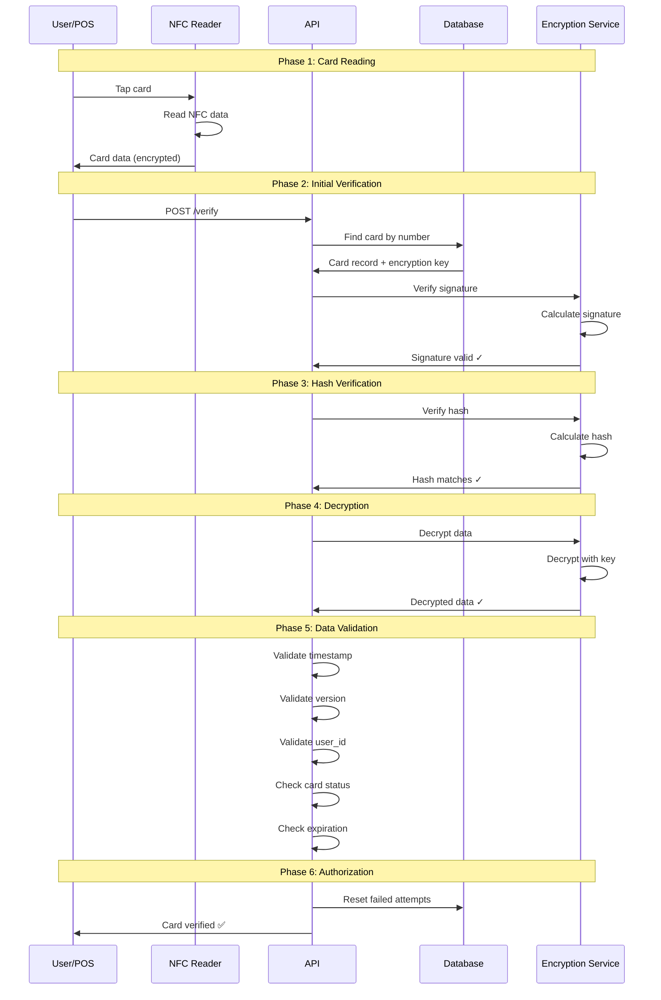

# 🔐 NFC Card Payment Security Guide

> Comprehensive security documentation for NFC Card Payment System

[](https://github.com/xjanova/Thaiprompt-Affiliate)
[](https://github.com/xjanova/Thaiprompt-Affiliate)

---

## Table of Contents

- [Security Overview](#security-overview)
- [Encryption](#encryption)
- [Two-Way Verification](#two-way-verification)
- [Anti-Fraud System](#anti-fraud-system)
- [Key Management](#key-management)
- [Security Auditing](#security-auditing)
- [Compliance](#compliance)
- [Threat Mitigation](#threat-mitigation)
- [Best Practices](#best-practices)

---

## Security Overview

### Security Layers

```
┌──────────────────────────────────────────────────────────┐
│              Multi-Layer Security Architecture            │
├──────────────────────────────────────────────────────────┤
│                                                           │
│  Layer 7: Application Security                           │
│  ├─ Rate Limiting                                        │
│  ├─ Input Validation                                     │
│  ├─ CSRF Protection                                      │
│  └─ SQL Injection Prevention                             │
│                                                           │
│  Layer 6: API Security                                   │
│  ├─ Bearer Token Authentication                          │
│  ├─ Token Expiration                                     │
│  ├─ IP Whitelisting                                      │
│  └─ Request Signing                                      │
│                                                           │
│  Layer 5: Data Security                                  │
│  ├─ AES-256-CBC Encryption                              │
│  ├─ HMAC-SHA256 Signature                               │
│  ├─ Hash Verification                                    │
│  └─ Timestamp Validation                                 │
│                                                           │
│  Layer 4: Transaction Security                           │
│  ├─ Two-Way Verification                                 │
│  ├─ Balance Verification                                 │
│  ├─ Double-Spend Prevention                              │
│  └─ Idempotency                                          │
│                                                           │
│  Layer 3: Card Security                                  │
│  ├─ Card Pairing                                         │
│  ├─ Failed Attempt Tracking                              │
│  ├─ Auto-Block Mechanism                                 │
│  └─ Expiration Checking                                  │
│                                                           │
│  Layer 2: Network Security                               │
│  ├─ HTTPS/TLS 1.3                                       │
│  ├─ Certificate Pinning                                  │
│  ├─ Firewall Rules                                       │
│  └─ DDoS Protection                                      │
│                                                           │
│  Layer 1: Physical Security                              │
│  ├─ NFC Card Protection                                  │
│  ├─ Reader Authentication                                │
│  ├─ Tamper Detection                                     │
│  └─ Secure Boot                                          │
│                                                           │
└──────────────────────────────────────────────────────────┘
```

---

## Encryption

### AES-256-CBC Implementation

#### Overview

```
┌─────────────────────────────────────────────────┐
│           AES-256-CBC Encryption Flow            │
└─────────────────────────────────────────────────┘

Input: Plain Card Data
  │
  ├─ Add Metadata (timestamp, nonce, version)
  │
  ▼
JSON Encode
  │
  ▼
AES-256-CBC Encryption
  ├─ Key: 256-bit random key
  ├─ IV: 128-bit random IV
  └─ Mode: CBC
  │
  ▼
Base64 Encode
  │
  ▼
Output: Encrypted Data
```

#### Encryption Process

```php
/**
 * Encrypt card data
 *
 * @param array $cardData Raw card data
 * @param string $encryptionKey 256-bit key
 * @return array Encrypted package
 */
public function encryptCardData(array $cardData, string $encryptionKey): array
{
    // 1. Prepare data with metadata
    $dataToEncrypt = array_merge($cardData, [
        'version' => self::ENCRYPTION_VERSION,
        'timestamp' => now()->timestamp,
        'nonce' => Str::random(16), // Anti-replay
    ]);

    // 2. Convert to JSON
    $jsonData = json_encode($dataToEncrypt);

    // 3. Generate random IV
    $iv = random_bytes(16); // 128-bit IV

    // 4. Encrypt with AES-256-CBC
    $encrypted = openssl_encrypt(
        $jsonData,
        'AES-256-CBC',
        base64_decode($encryptionKey),
        OPENSSL_RAW_DATA,
        $iv
    );

    // 5. Combine IV + encrypted data
    $encryptedWithIv = $iv . $encrypted;

    // 6. Base64 encode
    $encryptedData = base64_encode($encryptedWithIv);

    // 7. Generate hash for integrity
    $hash = hash_hmac('sha256', $encryptedData, $encryptionKey);

    // 8. Generate signature for authenticity
    $signature = $this->generateSignature($encryptedData, $hash, $encryptionKey);

    return [
        'encrypted_data' => $encryptedData,
        'hash' => $hash,
        'signature' => $signature,
        'version' => self::ENCRYPTION_VERSION,
    ];
}
```

#### Decryption Process

```php
/**
 * Decrypt card data
 *
 * @param string $encryptedData Base64 encrypted data
 * @param string $encryptionKey 256-bit key
 * @param string $expectedHash Expected hash
 * @return array|null Decrypted data or null
 */
public function decryptCardData(
    string $encryptedData,
    string $encryptionKey,
    string $expectedHash
): ?array {
    // 1. Verify hash first
    $calculatedHash = hash_hmac('sha256', $encryptedData, $encryptionKey);

    if (!hash_equals($expectedHash, $calculatedHash)) {
        throw new SecurityException('Hash mismatch - data tampered');
    }

    // 2. Base64 decode
    $encryptedWithIv = base64_decode($encryptedData);

    // 3. Extract IV and encrypted data
    $iv = substr($encryptedWithIv, 0, 16);
    $encrypted = substr($encryptedWithIv, 16);

    // 4. Decrypt
    $decrypted = openssl_decrypt(
        $encrypted,
        'AES-256-CBC',
        base64_decode($encryptionKey),
        OPENSSL_RAW_DATA,
        $iv
    );

    if ($decrypted === false) {
        throw new SecurityException('Decryption failed');
    }

    // 5. Parse JSON
    $data = json_decode($decrypted, true);

    if (json_last_error() !== JSON_ERROR_NONE) {
        throw new SecurityException('Invalid JSON data');
    }

    // 6. Verify version
    if (!isset($data['version']) || $data['version'] !== self::ENCRYPTION_VERSION) {
        throw new SecurityException('Unsupported encryption version');
    }

    // 7. Verify timestamp (not too old)
    if (isset($data['timestamp'])) {
        $age = now()->timestamp - $data['timestamp'];
        if ($age > 86400 * 365) { // 1 year
            throw new SecurityException('Card data expired');
        }
    }

    return $data;
}
```

### Digital Signature

#### HMAC-SHA256 Signing

```php
/**
 * Generate digital signature
 *
 * @param string $encryptedData Encrypted data
 * @param string $hash Data hash
 * @param string $encryptionKey Encryption key
 * @return string Signature
 */
protected function generateSignature(
    string $encryptedData,
    string $hash,
    string $encryptionKey
): string {
    // Combine all data
    $dataToSign = implode('|', [
        $encryptedData,
        $hash,
        config('app.key'),
        self::ENCRYPTION_VERSION,
    ]);

    // Generate HMAC-SHA256 signature
    return hash_hmac('sha256', $dataToSign, $encryptionKey);
}

/**
 * Verify digital signature
 *
 * @param string $encryptedData Encrypted data
 * @param string $hash Data hash
 * @param string $encryptionKey Encryption key
 * @param string $expectedSignature Expected signature
 * @return bool Valid or not
 */
protected function verifySignature(
    string $encryptedData,
    string $hash,
    string $encryptionKey,
    string $expectedSignature
): bool {
    $calculatedSignature = $this->generateSignature(
        $encryptedData,
        $hash,
        $encryptionKey
    );

    return hash_equals($expectedSignature, $calculatedSignature);
}
```

---

## Two-Way Verification

### Verification Flow



### Implementation

```php
/**
 * Verify card authenticity (Two-Way Verification)
 *
 * @param string $encryptedData Data from card
 * @param string $encryptionKey Encryption key
 * @param string $expectedHash Expected hash
 * @param string $expectedSignature Expected signature
 * @return array Verification result
 */
public function verifyCardAuthenticity(
    string $encryptedData,
    string $encryptionKey,
    string $expectedHash,
    string $expectedSignature
): array {
    try {
        // Step 1: Verify signature (authenticity)
        $signatureValid = $this->verifySignature(
            $encryptedData,
            $expectedHash,
            $encryptionKey,
            $expectedSignature
        );

        if (!$signatureValid) {
            return [
                'valid' => false,
                'data' => null,
                'error' => 'Invalid signature - fake card detected',
                'error_code' => 'SIGNATURE_MISMATCH',
            ];
        }

        // Step 2: Decrypt data
        $data = $this->decryptCardData(
            $encryptedData,
            $encryptionKey,
            $expectedHash
        );

        if ($data === null) {
            return [
                'valid' => false,
                'data' => null,
                'error' => 'Decryption failed',
                'error_code' => 'DECRYPTION_FAILED',
            ];
        }

        // Step 3: Validate data structure
        if (!$this->validateCardDataStructure($data)) {
            return [
                'valid' => false,
                'data' => null,
                'error' => 'Invalid card data structure',
                'error_code' => 'INVALID_STRUCTURE',
            ];
        }

        // Success
        return [
            'valid' => true,
            'data' => $data,
            'error' => null,
            'error_code' => null,
        ];

    } catch (SecurityException $e) {
        return [
            'valid' => false,
            'data' => null,
            'error' => $e->getMessage(),
            'error_code' => $e->getCode(),
        ];
    }
}
```

---

## Anti-Fraud System

### Failed Attempt Tracking

```php
/**
 * Track failed verification attempts
 */
class NFCCard extends Model
{
    const MAX_FAILED_ATTEMPTS = 3;
    const BLOCK_DURATION_MINUTES = 30;

    /**
     * Increment failed attempts
     */
    public function incrementFailedAttempts(): void
    {
        $this->increment('failed_attempts');

        // Auto-block after max attempts
        if ($this->failed_attempts >= self::MAX_FAILED_ATTEMPTS) {
            $this->block('Too many failed verification attempts');

            // Log security event
            Log::channel('security')->warning('Card auto-blocked', [
                'card_id' => $this->id,
                'card_number' => $this->card_number,
                'failed_attempts' => $this->failed_attempts,
                'ip_address' => request()->ip(),
            ]);

            // Send alert to admin
            event(new CardBlockedEvent($this, 'auto_block'));
        }
    }

    /**
     * Reset failed attempts
     */
    public function resetFailedAttempts(): bool
    {
        return $this->update(['failed_attempts' => 0]);
    }
}
```

### Real-time Fraud Detection

```php
/**
 * Fraud detection service
 */
class FraudDetectionService
{
    /**
     * Check for suspicious activity
     */
    public function checkTransaction(NFCTransaction $transaction): array
    {
        $suspiciousFactors = [];

        // 1. Velocity check (too many transactions)
        $recentCount = NFCTransaction::where('nfc_card_id', $transaction->nfc_card_id)
            ->where('created_at', '>=', now()->subMinutes(5))
            ->count();

        if ($recentCount >= 10) {
            $suspiciousFactors[] = 'HIGH_VELOCITY';
        }

        // 2. Amount check (unusually large)
        $avgAmount = NFCTransaction::where('nfc_card_id', $transaction->nfc_card_id)
            ->where('status', 'completed')
            ->avg('amount');

        if ($transaction->amount > $avgAmount * 5) {
            $suspiciousFactors[] = 'LARGE_AMOUNT';
        }

        // 3. Location check (impossible travel)
        $lastTransaction = NFCTransaction::where('nfc_card_id', $transaction->nfc_card_id)
            ->where('status', 'completed')
            ->latest()
            ->first();

        if ($lastTransaction && $lastTransaction->location !== $transaction->location) {
            $timeDiff = $transaction->created_at->diffInMinutes($lastTransaction->created_at);
            if ($timeDiff < 5) {
                $suspiciousFactors[] = 'IMPOSSIBLE_TRAVEL';
            }
        }

        // 4. Pattern check (unusual behavior)
        // ... more checks

        $riskScore = count($suspiciousFactors) * 25;

        return [
            'suspicious' => $riskScore >= 50,
            'risk_score' => $riskScore,
            'factors' => $suspiciousFactors,
        ];
    }
}
```

---

## Key Management

### Key Generation

```php
/**
 * Generate secure encryption key
 *
 * @return string Base64 encoded 256-bit key
 */
public function generateEncryptionKey(): string
{
    // Generate 32 random bytes (256 bits)
    $key = random_bytes(32);

    // Base64 encode for storage
    return base64_encode($key);
}
```

### Key Storage

```php
/**
 * Store encryption key securely
 *
 * Best practices:
 * 1. Never store keys in code
 * 2. Use environment variables
 * 3. Use key management service (AWS KMS, Azure Key Vault)
 * 4. Encrypt keys at rest
 * 5. Rotate keys regularly
 */

// ❌ BAD: Hardcoded key
$key = 'my-secret-key-12345';

// ✅ GOOD: Environment variable
$key = env('NFC_MASTER_KEY');

// ✅ BETTER: Key management service
$key = app(KeyManagementService::class)->getKey('nfc_master');

// ✅ BEST: Hardware Security Module (HSM)
$key = app(HSMService::class)->getKey('nfc_master');
```

### Key Rotation

```php
/**
 * Rotate encryption keys
 */
class KeyRotationService
{
    /**
     * Rotate card encryption key
     */
    public function rotateCardKey(NFCCard $card): void
    {
        DB::transaction(function () use ($card) {
            // 1. Get old key
            $oldKey = decrypt($card->metadata['_encryption_key']);

            // 2. Decrypt with old key
            $data = $this->encryptionService->decryptCardData(
                $card->encrypted_data,
                $oldKey,
                $card->encryption_key_hash
            );

            // 3. Generate new key
            $newKey = $this->encryptionService->generateEncryptionKey();

            // 4. Re-encrypt with new key
            $newPackage = $this->encryptionService->createCardEncryptionPackage(
                $data,
                $newKey
            );

            // 5. Update card
            $card->update([
                'encrypted_data' => $newPackage['encrypted_data'],
                'encryption_key_hash' => $newPackage['encryption_key_hash'],
                'card_signature' => $newPackage['signature'],
                'metadata' => array_merge(
                    $card->metadata,
                    ['_encryption_key' => encrypt($newKey)]
                ),
            ]);

            // 6. Log rotation
            Log::info('Card key rotated', ['card_id' => $card->id]);
        });
    }
}
```

---

## Security Auditing

### Audit Logging

```php
/**
 * Security audit logger
 */
class SecurityAudit
{
    /**
     * Log security event
     */
    public static function log(string $event, array $data): void
    {
        Log::channel('security')->info($event, array_merge($data, [
            'timestamp' => now()->toIso8601String(),
            'ip_address' => request()->ip(),
            'user_agent' => request()->userAgent(),
            'user_id' => auth()->id(),
        ]));
    }

    /**
     * Log card verification
     */
    public static function logVerification(NFCCard $card, bool $success): void
    {
        self::log('card_verification', [
            'card_id' => $card->id,
            'card_number' => $card->masked_card_number,
            'success' => $success,
        ]);
    }

    /**
     * Log payment
     */
    public static function logPayment(NFCTransaction $transaction): void
    {
        self::log('payment_processed', [
            'transaction_id' => $transaction->transaction_id,
            'card_id' => $transaction->nfc_card_id,
            'amount' => $transaction->amount,
            'status' => $transaction->status,
        ]);
    }
}
```

---

## Compliance

### PCI DSS Compliance

✅ **Requirement 1:** Install and maintain firewall configuration
✅ **Requirement 2:** Do not use vendor-supplied defaults
✅ **Requirement 3:** Protect stored cardholder data (AES-256)
✅ **Requirement 4:** Encrypt transmission (TLS 1.3)
✅ **Requirement 5:** Protect against malware
✅ **Requirement 6:** Develop secure systems
✅ **Requirement 7:** Restrict access by need to know
✅ **Requirement 8:** Identify and authenticate access
✅ **Requirement 9:** Restrict physical access
✅ **Requirement 10:** Track and monitor access (audit logs)
✅ **Requirement 11:** Regularly test security systems
✅ **Requirement 12:** Maintain security policy

### GDPR Compliance

✅ Data encryption at rest and in transit
✅ Right to access (API endpoints)
✅ Right to deletion (soft delete)
✅ Data portability (export CSV)
✅ Consent management
✅ Audit logging

---

## Best Practices

### For Developers

1. **Never log sensitive data**
```php
// ❌ BAD
Log::info('Card data', ['card_number' => $cardNumber]);

// ✅ GOOD
Log::info('Card verified', ['card_id' => $card->id]);
```

2. **Always use prepared statements**
```php
// ❌ BAD
DB::select("SELECT * FROM nfc_cards WHERE card_number = '$number'");

// ✅ GOOD
DB::select('SELECT * FROM nfc_cards WHERE card_number = ?', [$number]);
```

3. **Validate all input**
```php
// ✅ GOOD
$validated = $request->validate([
    'card_number' => 'required|string|size:16',
    'amount' => 'required|numeric|min:0.01',
]);
```

### For Administrators

1. **Regular key rotation** - Rotate keys every 90 days
2. **Monitor audit logs** - Review logs daily
3. **Security updates** - Apply patches immediately
4. **Access control** - Limit admin access
5. **Backup** - Daily encrypted backups

---

<div align="center">

**[⬆ Back to Top](#-nfc-card-payment-security-guide)**

🔒 **Security is not a product, but a process**

</div>
